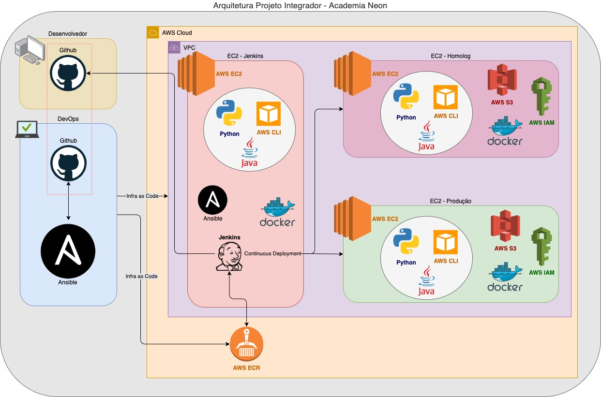

# Projeto Integrador (Curso DevOps) - Academia Neon
Projeto Integrador para a Academia Neon DevOps - Grupo DevOpers - Utilizando Ansible, Docker, Jenkins, AWS

## Sobre o Projeto Integrador
Introdução: Será fornecido um APP feito em NodeJS que escreve e lê arquivos no S3. As configurações necessárias para esse app funcionar serão definidas por variáveis de ambiente (environment).

O objetivo: Criar as duas máquinas de app na AWS junto com uma máquina que conterá o Jenkins (para facilitar a evolução
fora da sala de aula). Com o jenkins no ar elas deverão construir as pipelines clonando o projeto, executando os testes e configurando 
com as devidas variáveis de ambiente e por fim publicando no ambiente de destino: Prod ou Homolog.

Resultados Esperados: Com os aplicativos NodeJS no ar as alunas devem observar a url /healthcheck de cada um deles para ver se foram ou não configurados com sucesso. Deverão testar a ação de upload de imagens da aplicação que foi fornecida e se estiver com os tokens corretos do S3 fará o upload com sucesso.

## Sobre este README
A intenção desse README, além de falar sobre o projeto e as ferramentas utilizadas para a construção do mesmo, é ajudar no entendimento de como o projeto foi construído, explicando passo a passo do que foi feito e como foi feito, para que qualquer pessoa que esteja iniciando seus estudos seja capaz de entender e executar.

Para quem deseja apenas visualizar os "entregáveis" finais do Projeto, consultar os itens:
* [`Provisionando Ambiente AWS`](#provisionando-ec2--s3--iam--ecr-na-aws)
* [`Configurando EC2`](#configurando-maquinas-ec2) 
* [`Configurando Jenkins`](#configurando-jenkins)
* [`Pipeline Jenkins`](#Pipeline-jenkins)
* [`Evidências`](#evidências)
* [`Referências`](#referências)
* [`Apresentação - PowerPoint`](docs/DevOpers_PI.pptx)

Para quem deseja replicar e entender melhor este projeto, documentação completa, um passo a passo, do que foi feito e como foi feito, para que qualquer pessoa que esteja iniciando seus estudos seja capaz de entender e executar.          
* [`Tutorial de Como Fazer este Projeto do Zero`](docs/DevOpers_PI.docx)

Caso não tenha um ambiente de trabalho adequado por favor verificar o item abaixo.           
* [`Tutorial de Como Criar um Desktop de Trabalho`](https://github.com/andresavs/AcademiaNeon_DevOps)

## Arquitetura

## Provisionando EC2 + S3 + IAM + ECR na AWS
Partindo do presuposto que seu ambiente de trabalho já está preparado e com as devidas ferramentas instaladas e configuradas, podemos iniciar a criação do ambiente na AWS, caso contrário volte para a Preparação Inicial.

O objetivo é criar um ambiente de Homologação e Produção + um servidor que rodará o Jenkins.
* Ao ser executado o item abaixo irá criar uma VPC e todos os itens obrigatórios relacionados a ela (por exemplo, subnet, security group, entre outros), logo após irá gerar uma key-pair e salvar. Vai criar também uma EC2 para o Jenkins e um ECR (Elastic Container Registry), em seguida uma EC2 para Produção, um user e um bucket S3. E por último criará uma EC2 para Homologação, um user e um bucket S3.

    * `$ ansible-playbook playbooks/aws_provisioning.yml`

O script acima utiliza os seguintes scripts: aws_provisioning_vpc.yml, aws_provisioning_jenkins.yml, aws_provisioning_producao.yml, aws_provisioning_homolog.yml. Todos os playbooks 

* Para validar se foi criado acessar o console da AWS ou executar o seguinte comando:
    * `$ ansible-inventory --graph aws_ec2`

## Configurando Maquinas EC2 
Após todo o ambiente criado na AWS, precisamos configurar as máquinas, todas as 3 EC2 criadas terão os pacotes atualizados e os seguintes itens instalados via ansible: docker, awscli, java, python, entre outros. Já a EC2 do Jenkins vamos instalar também o ansible e o jenkins. 

* Atualizar pacotes e instalar awscli, java, python - Esse script foi preparado para atualizar as 3 EC2 ao ser executado...
    * `$ ansible-playbook playbooks/config_all-ec2.yml`

* Instalar docker - Esse script foi preparado para atualizar as 3 EC2 ao ser executado...
    * `$ ansible-playbook playbooks/install_docker_all-ec2.yml`

* Instalar ansible - Esse script foi preparado para atualizar apenas a EC2 do Jenkins ao ser executado...
    * `$ ansible-playbook playbooks/install_ansible_ec2-jenkins.yml`

* Instalar jenkins - Esse script foi preparado para atualizar apenas a EC2 do Jenkins ao ser executado...
    * `$ ansible-playbook playbooks/install_jenkins_ec2-jenkins.yml`

Observação: todos os playbooks podem ser executados com o parametro "-vvv" para ter um nível maior de detalhes.                                                          
Ex: `$ ansible-playbook playbooks/aws_provisioning.yml -vvv`     

## APP NodeJS utilizado
Foi realizado um fork do [repositório do Desenvolvedor](https://github.com/bgsouza/digitalhouse-devops-app.git) para [repositório Dev do Projeto](https://github.com/andresavs/digitalhouse-devops-app.git) pois teriamos que customizar o arquivo Jenksfile.

## Evidências
* Pipeline
    * [Pipeline](docs/PipelineOk.png) executado com sucesso.
    * [HealthCheck Homologação](docs/healthcheck-homolog.png) executado com sucesso.
    * [HealthCheck Produção](docs/healthcheck-prod.png) executado com sucesso.
    * [Output Pipeline](docs/Output-Pipeline.pdf) de todos os passos.

* Url
    * [HealthCheck Homologação](docs/url-healthcheck-homolog.png) executado com sucesso.
    * [HealthCheck Produção](docs/url-healthcheck-prod.png) executado com sucesso.
    * [Upload Homologação](docs/url-upload-homolog.png) executado com sucesso.
    * [Upload Produção](docs/url-upload-prod.png) executado com sucesso.

* AWS S3
    * [Buckets S3](docs/Buckets-S3.png) criados.
    * [Bucket S3 Homolog](docs/BucketS3-homolog.png) com a imagem.
    * [Bucket S3 Produção](docs/BucketS3-prod.png) com a imagem.

## Referências
* Professores
    * Bruno G. Souza - https://github.com/bgsouza/digitalhouse-devops-app
    * Krishna Pennacchioni - https://github.com/agentelinux/devops-pi/tree/grupo1
* Material do curso - Playground Digital House
* Documentação Oficial
    * https://www.ansible.com/
    * https://galaxy.ansible.com/
    * https://github.com/
    * https://www.docker.com/
    * https://www.jenkins.io/
    * https://aws.amazon.com/pt/
    * https://www.markdownguide.org/
