# Projeto Integrador (Curso DevOps) - Academia Neon
Projeto Integrador para a Academia Neon DevOps - Grupo DevOpers - Utilizando Ansible, Docker, Jenkins, AWS

## Sobre o Projeto Integrador
Introdução: Será fornecido um APP feito em NodeJS que escreve e lê arquivos no S3. As configurações necessárias para esse app funcionar serão definidas por variáveis de ambiente (environment).

O objetivo: Criar as duas máquinas de app na AWS junto com uma máquina que conterá o Jenkins (para facilitar a evolução
fora da sala de aula). Com o jenkins no ar elas deverão construir as pipelines clonando o projeto, executando os testes e configurando 
com as devidas variáveis de ambiente e por fim publicando no ambiente de destino: Prod ou Homolog.

Resultados Esperados: Com os aplicativos NodeJS no ar as alunas devem observar a url /healthcheck de cada um deles para ver se foram ou não configurados com sucesso. Deverão testar a ação de upload de imagens da aplicação que foi fornecida e se estiver com os tokens corretos do S3 fará o upload com sucesso.

## Sobre este README
A intenção desse README, além de falar sobre o projeto e as ferramentas utilizadas para a construção do mesmo, é ajudar no entendimento de como o projeto foi construído, explicando passo a passo do que foi feito e como foi feito, para que qualquer pessoa que esteja iniciando seus estudos seja capaz de entender e executar.

Para quem deseja apenas visualizar os "entregáveis" finais do Projeto, consultar os itens:
* [`Provisionando Ambiente AWS`](#provisionando-ec2--s3--iam--ecr-na-aws)
* [`Configurando EC2`](#configurando-maquinas-ec2) 
* [`Configurando Jenkins`](#configurando-jenkins)
* [`Pipeline Jenkins`](#Pipeline-jenkins)
* [`Evidências`](#evidências)
* [`Referências`](#referências)
* [`Apresentação - PowerPoint`](docs/DevOpers_PI.pptx)

## Arquitetura

## Preparação Inicial
Caso não tenha um ambiente de trabalho adequado por favor verificar o repositório [AcademiaNeon_DevOps](https://github.com/andresavs/AcademiaNeon_DevOps). E somente após isso seguir os passos abaixo.

Para conseguirmos executar os playbooks via Ansible, precisamos configurar as credenciais de segurança em nosso repositório. Supondo que o clone deste projeto tenha sido feito, seguir os passos abaixo conforme descrito.

1. É necessário criar uma conta na [AWS](https://portal.aws.amazon.com/billing/signup#/start).

**IMPORTANTE**: Pensando que seu ambiente foi criado conforme orientações do item Preparação Inicial, sempre que for falado nesse readme desktop de trabalho e/ou vm é a máquina linux que é utilizada para criar e executar o nosso projeto, nunca seu computador pessoal, então garanta que seu terminal esteja logado nela, como dito anteriormente, no nosso caso é a vm criada com o vagrant e para garantir que todos os passos sejam executados com sucesso, o terminal precisar estar logado com o usuário ubuntu na vm ubuntu-bionic e dentro da pasta do Projeto:

 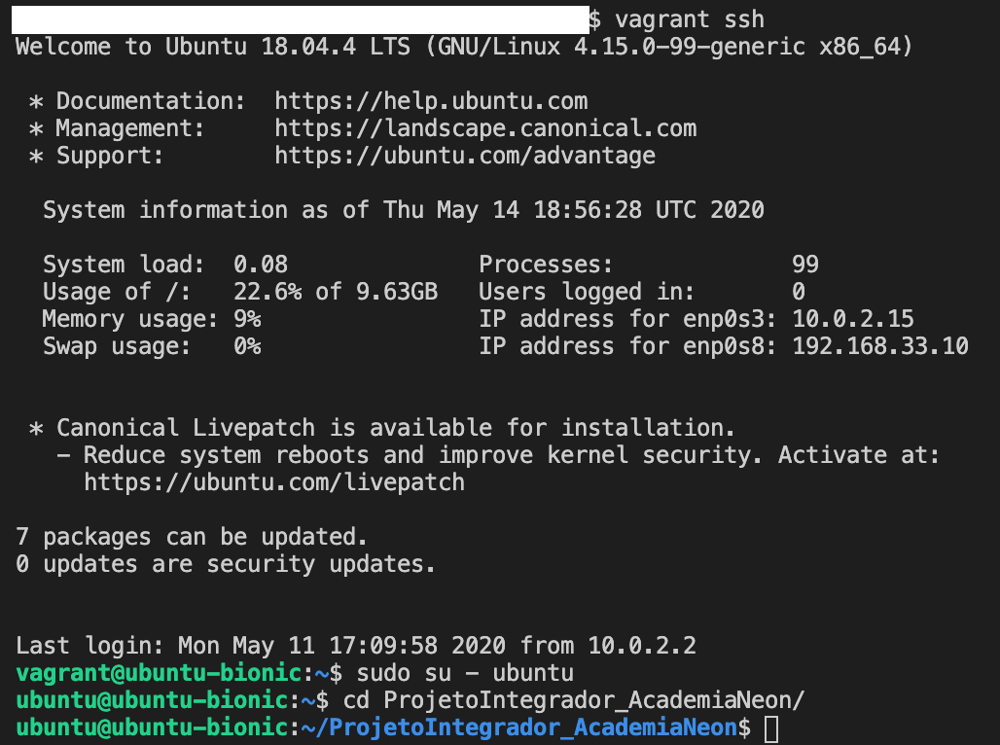

2. Dentro do seu desktop de trabalho, **no nosso caso é a vm criada com o vagrant**, que vamos acessar via vscode, criar um arquivo para as senhas.
Para quem estiver familiarizado pode utilizar o vi para criar/editar o arquivo.

* `$ vi ~/.ansible/.vault_pass`

Ou então utilizar o echo e substituir o texto <"MinhaSenha"> pela "senha".

* `$ echo <"MinhaSenha"> ~/.ansible/.vault_pass`

3. Criar o arquivo aws_credentials.yml dentro da pasta vars do repositório do projeto com as credenciais de segurança do usuário root da AWS.

    * Acessar o console da AWS com o user root e ir em:

        * My Security Credentials → Access keys (access key ID and secret access key) → Create New Access Key

        Importante: Fazer o download das informações ou até mesmo copiar em algum arquivo no seu computador, pois vamos precisar dos dados no futuro e uma vez criado a informação do secret key não fica disponível mais.

    * Criar o arquivo e colocar as informações conforme abaixo:

        AWSAccessKeyId: ABCDE*******       
        AWSSecretKey: aBCD123-*******

4. Encriptar o arquivo aws_credentials.yml

    * `$ ansible-vault encrypt playbooks/vars/aws_credentials.yml `

5. Caso queria validar se ficou ok executar os comandos abaixo.

    * Para visualizar conteúdo do arquivo

        * `$ cat playbooks/vars/aws_credentials.yml `
    

    * Para descriptografar o arquivo com nosso arquivo de senhas. O comando abaixo não tem quebra de linha.

        * `$ ansible-vault view playbooks/vars/aws_credentials.yml --vault-password-file ~/.ansible/.vault_pass `

**Importante**: Mesmo criptrografado evitar de subir esse arquivo aws_credentials.yml no git. Para isso podemos utilizar o arquivo .gitignore.

## Utilizando arquivo .gitignore
Para não efetuar commits de arquivos e ou pastas podemos criar o arquivo .gitignore na raiz do repositório de nosso projeto, antes de enviar as atualizados para o git, para ficar mais fácil e visual podemos "categorizar" os itens a serem ignorados. Uma dica para saber como deve colocar o nome dos arquivos/pastas dentro do .gitignore, é executar o comando git status  e ver o que e como ele traz as informações, assim fica fácil saber como você deve colocar. Abaixo vou deixar um print de um arquivo .gitignore.

Após realizar as alterações no repositório o primeiro comando seria o git status, ele vai mostrar todos os arquivos criados e alterados.

 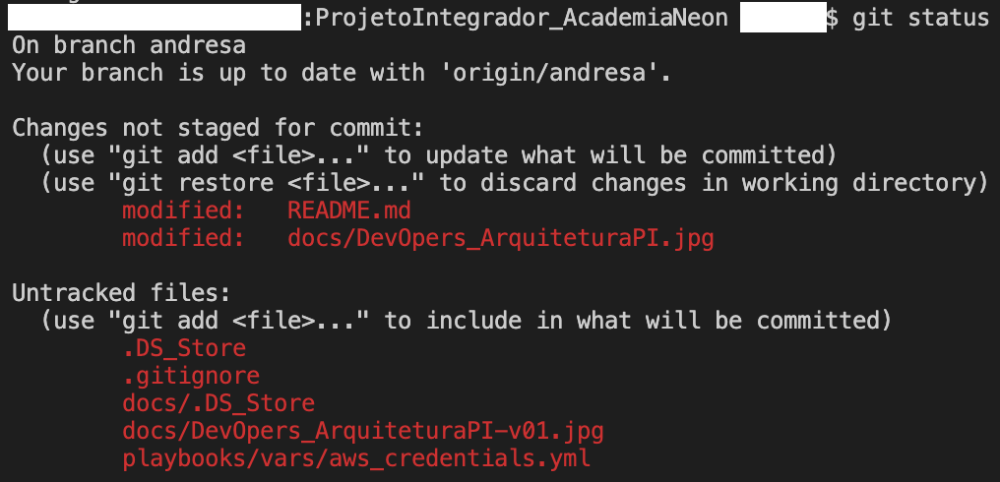

Preencha o arquivo gitignore com os arquivos que não deseja adicionar no seu repositório no git.

 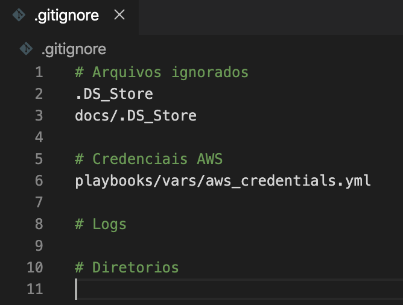

Faça o comando git status novamente e vai perceber que tudo que colocou dentro do arquivo .gitignore não aparece mais.

 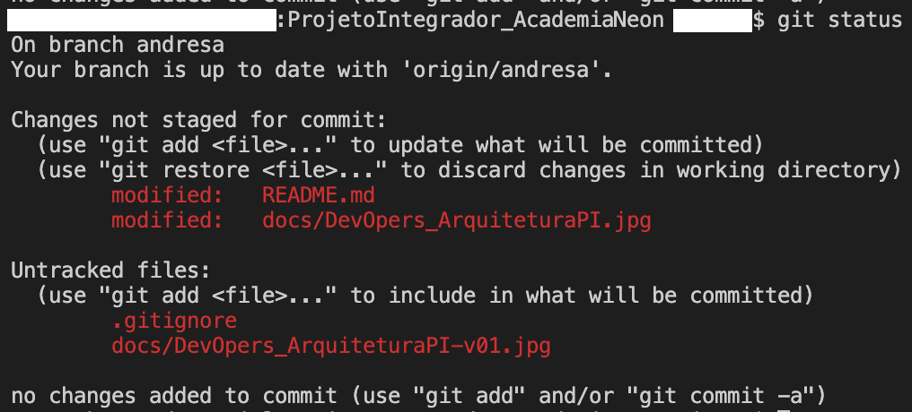

## Configurar AWSCLI no desktop de trabalho
Para ter acesso aos recursos da aws via linha de comando em nosso desktop de trabalho é necessário configurar as credenciais do seu usuário. Caso queira, seguir os passos descritos abaixo:

Se você já realizou este passo quando criou a vm lá no item Preparação Inicial, não será necessário repetir.

1. Configurar o AWS CLI

    * `$ aws configure`

        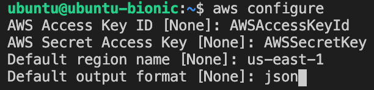

Preencher com as keys da AWS salvas anteriormente. Colocar a região de trabalho (a us-east-1 é a mais economica no momento) e o formato por padrão é json, mas você pode colocar também.

2. Alguns comandos para testar:

    * `$ aws iam list-access-keys` 
    * `$ aws ec2 describe-regions` 

## Ententendo e Customizando os Playbooks
Caso queira apenas executar os playbooks para criar a Infra ir para o item [`Provisionando EC2 + S3 + IAM + ECR na AWS`](#provisionando-ec2--s3--iam--ecr-na-aws)

* **Falando um pouco sobre a estrutura para o ansible**:

    * inventory/hosts

        Utilizada para definiçao dos hosts e algumas variáveis de ambiente importantes para os hosts.

        ***ansible_ssh_private_key_file=./dh-pi-devopers-key.pem***

        [Mais informações sobre inventory e hosts.](https://docs.ansible.com/ansible/2.3/intro_inventory.html)

    * ansible.cfg

        É o arquivo de configuração do ansible, indica onde fica a pasta inventory por exemplo

        ***[defaults]***                            
               ***inventory=inventory/***

        [Mais informações sobre o arquivo ansible.cfg.](https://docs.ansible.com/ansible/latest/reference_appendices/config.html)

    * .gitignore

        Como já falado este arquivo pode ser criado para ignorar itens que você vai atualizar no seu repositório git.

* **Falando um pouco sobre a criação da Infra na AWS**: 

    Nosso arquivo principal para criar a Infra na AWS é o aws_provisioning.yml, mas ao abrir ele vou se vai se deparar com outros 4 arquivos dentro precedidos pelo comando import_playbook. Foi construído dessa forma para que seja executado apenas um playbook que crie toda a Infra, mas que também fique segmentado e mais fácil para entender.

     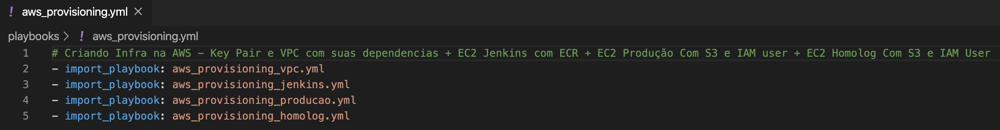

    * Playbook aws_provisioning_vpc.yml 

        

        * Item var_files
            Neste item temos dois arquivos de variáveis, um está armazenando nossas credenciais da AWS criptografadas (vars/aws_credentials.yml) que criamos no item Preparação Inicial deste README, e a outro (vars/aws.yml) tem as variáveis que serão usadas nas tasks. Como sempre, segue um link da [Documentação Oficial](https://docs.ansible.com/ansible/2.5/user_guide/playbooks_variables.html) que fala mais sobre variáveis.

             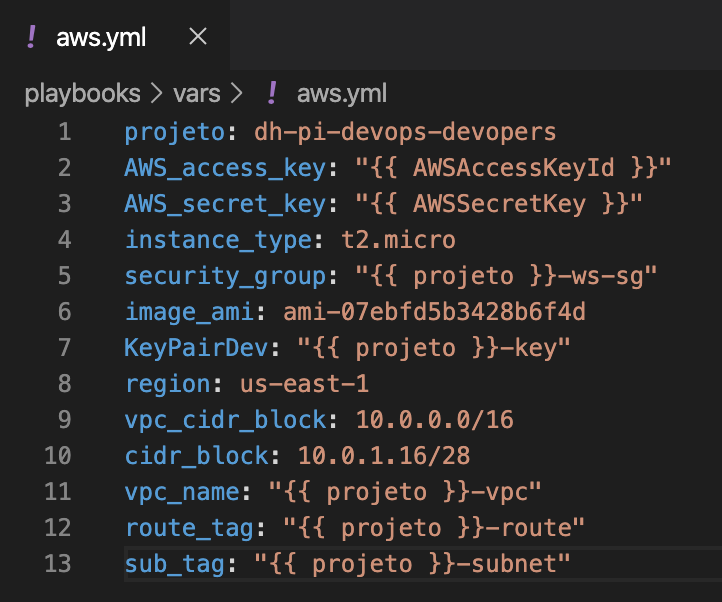

             Breve comentário sobre cada item:                  
                ***projeto: dh-pi-devops-devopers*** → Compõe as demais variáveis desse arquivo.                                         
                ***AWS_access_key: "{{ AWSAccessKeyId }}"*** → Credenciais AWS - está no arquivo criptografado no item Preparação Inicial vars/aws_credentials.yml.          
                ***AWS_secret_key: "{{ AWSSecretKey }}"*** → Credenciais AWS - está no arquivo criptografado no item Preparação Inicial vars/aws_credentials.yml.                         
                ***instance_type: t2.micro*** → Define o tipo da instância que será criado na AWS, para este projeto será uma t2.micro.        
                ***security_group: "{{ projeto }}-ws-sg"*** → Define o nome do Security Group.              
                ***image_ami: ami-07ebfd5b3428b6f4d*** → Define a imagem que vamos utilizar para criar a máquina na AWS.               
                ***KeyPairDev: "{{ projeto }}-key"*** → Define o nome da key pair.              
                ***region: us-east-1*** → Define a [região](https://docs.aws.amazon.com/pt_br/AWSEC2/latest/UserGuide/using-regions-availability-zones.html#concepts-available-regions) que vamos utilizar na AWS.                      
                ***vpc_cidr_block: 10.0.0.0/16*** → Define o CIDR (Tamanho da VPC = quantidade de ips que ela vai ter) block da VPC.                 
                ***cidr_block: 10.0.1.16/28*** → Define o CIDR (Tamanho da Subnet = quantidade de ips que ela vai ter) block da Subnet.                  
                ***vpc_name: "{{ projeto }}-vpc"*** → Define o nome da VPC.                   
                ***route_tag: "{{ projeto }}-route"*** → Define o nome da Route Table (Faz parte da VPC).              
                ***sub_tag: "{{ projeto }}-subnet"*** → Define o nome da Subnet (Faz parte da VPC).                                

            [Link útil sobre VPC e Subnets e CIDR.](https://docs.aws.amazon.com/vpc/latest/userguide/what-is-amazon-vpc.html)                 
            [Link útil sobre VPC e Route Tables.](https://docs.aws.amazon.com/vpc/latest/userguide/VPC_Route_Tables.html)

        * Criando a Key Pair das instâncias EC2
            Apesar de ser um item das EC2s, ele ficou aqui pois é usado em todas as EC2 e é criado é baixado apenas uma única vez.
            Para saber mais sobre a EC2 Key Pairs acessar a [Documentação Oficial](https://docs.aws.amazon.com/pt_br/AWSEC2/latest/UserGuide/ec2-key-pairs.html).

             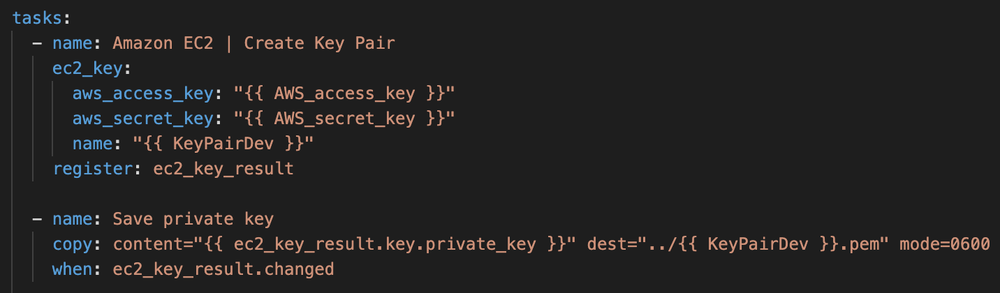     

             [Link útil - módulo ansible key pair.](https://docs.ansible.com/ansible/latest/modules/ec2_key_module.html)       

        * Criando a Amazon VPC - Amazon Virtual Private Cloud
            Podemos dizer que a Amazon VPC é uma seção isolada logicamente dentro da nuvem da AWS onde você cria e executa os demais serviços. Para mais informações acessar a [Documentação Oficial](https://aws.amazon.com/pt/vpc/). Para criar a VPC direto no console da AWS é bem simples e intuitivo e muitos itens obrigatórios e dependentes são criados automaticamente, todos os itens "obrigatórios" foram criados em no aws_provisioning_vpc.yml playbook e podem ser identificados dentro do item tasks → name. Todos os itens que estão "{{ xxxxx }}" são variavéis que definimos em nosso arquivo vars/aws_credentials.yml ou são "itens de configuração padrão". O único item que pode ser customizado direto no aws_provisioning_vpc.yml é o ***resource_tags: { "Environment":"PI-AcademiaNeon" }***, que é usado para identificar o ambiente daquela vpc, no nosso projeto, usamos PI-AcademiaNeon, pois ele se refere exatamente ao projeto integrador do Curso DevOps da Academia Neon. Isse item por ser mais seguimentado ainda, por exemplo, na vpc criamos um ambiente de Desenvolvimento, e criamos mais de um subnet - segmentamos os ranges de ips para dois sub-ambientes (não é nosso caso hoje), onde teremos o Dev DB para banco de dados e o Dev App para a aplicação.

            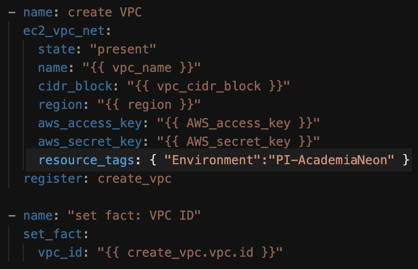 

            [Link útil - módulo ansible ec2-vpc.](https://docs.ansible.com/ansible/latest/modules/ec2_vpc_net_module.html)                  
            [Link útil - módulo ansible ec2-subnet.](https://docs.ansible.com/ansible/latest/modules/ec2_vpc_subnet_module.html)                    
            [Link útil - módulo ansible ec2-securitygroup.](https://docs.ansible.com/ansible/latest/modules/ec2_group_module.html)               
            [Link útil - módulo ansible ec2-internetgateway.](https://docs.ansible.com/ansible/latest/modules/ec2_vpc_igw_module.html)                    
            [Link útil - módulo ansible ec2-routetable.](https://docs.ansible.com/ansible/latest/modules/ec2_vpc_route_table_module.html)

    * Playbooks aws_provisioning_jenkins.yml + aws_provisioning_homolog.yml + aws_provisioning_producao.yml

        Nesses 3 playbooks são criados 3 (uma em cada um) [Amazon EC2](https://aws.amazon.com/pt/ec2/) - Amazon Elastic Compute Cloud, que pode ser considerada uma máquina virtual na nuvem, mas o conceito real dela é muito mais que isso. 

        * aws_provisioning_jenkins.yml
            A EC2 criada nesse playbook será o servidor Jenkins, por isso o nome. E também será criado um repositório [ECR](https://aws.amazon.com/pt/ecr/) - Amazon Elastic Container Registry, que é um serviço totalmente gerenciado que armazena imagens de conteiners do Docker, nele será armazenado e versionado as imagens que nosso pipeline irá gerar.

            Além do arquivo de variáveis também podemos definir variáveis específicas por playbooks, neste temos o nome que nossa EC2 terá, vide linha 8 e 9.              
                ***vars:***                                                 
                   ***name_service: devopers-jenkins***
            
            Temos as seguintes tasks nesse playbook:                          
                ***- name: Launch the new EC2 Instance 22*** → Cria a instância EC2 de acordo com as variáveis do itens vars_files e o vars.                               
                ***- name: Wait for SSH to come up*** → Aguarda o serviço de SSH ficar disponível, ou seja, a terminar a configuração e máquina ficar running.             
                ***- name: Create AWS ECR*** → Cria o repositório de imagens de containers Docker, o nome é definido por *name: digitalhouse-devops-app*, e usamos o nome da imagem como nome do repositório.        

            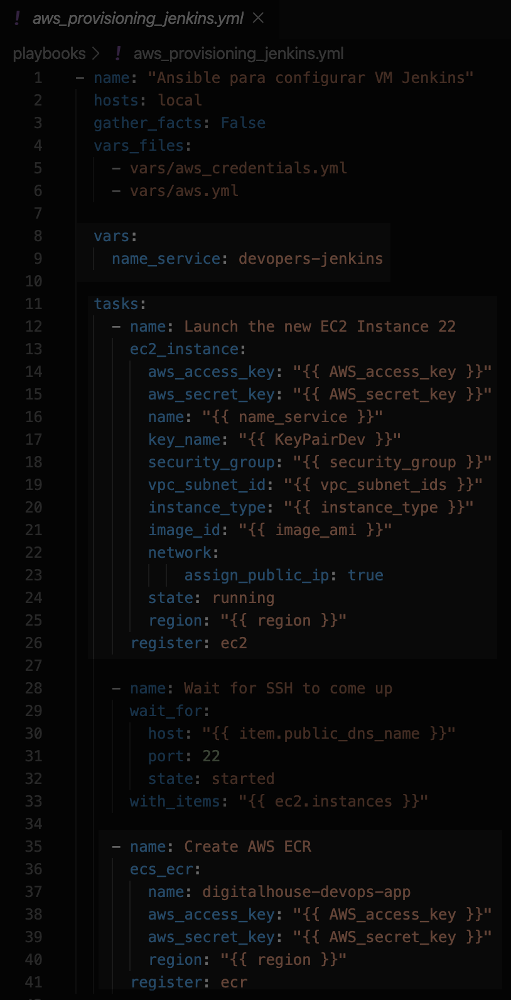 

        [Link útil - módulo ansible ecr.](https://docs.ansible.com/ansible/latest/modules/ecs_ecr_module.html)                

        * aws_provisioning_homolog.yml
            A EC2 criada nesse playbook será o servidor de Homologação, por isso o nome. E também será criado um usuário [IAM](https://aws.amazon.com/pt/iam/) - AWS Identity and Access Management, onde gerenciamos os acessos aos serviços e recursos da AWS, criando usuários, grupos, roles, entre outros. E um bucket [S3](https://aws.amazon.com/pt/s3/) - Amazon Simple Storage Service (Amazon S3), é um serviço de armazenamento de objetos resiliente, para o ambiente de Homologação.

            Além do arquivo de variáveis também podemos definir variáveis específicas por playbooks, neste temos o nome que nossa EC2 terá (vide linha 8 e 9), o usuário IAM (vide linha 10) e o nome do nosso bucket S3 (vide linha 11). 

            ***vars:***    
              ***name_service: devopers-homolog***    
              ***name_aim_user_s3: dh_devopers_homolog***   
              ***name_bucket_s3: dh-devopers-homolog***
            
            Temos as seguintes tasks nesse playbook:

            ***- name: Launch the new EC2 Instance 22*** → Cria a instância EC2 de acordo com as variáveis do itens vars_files e o vars.                         
            ***- name: Wait for SSH to come up*** → Aguarda o serviço de SSH ficar disponível, ou seja, a terminar a configuração e máquina ficar running.               
            ***- name: Create iam user "{{ name_aim_user_s3 }}"*** → Criar o usuário IAM e dá as permissões.                                     
            ***- name: name: Create a buckets*** → Cria o bucket S3 (apesar de criar esse módulo é utilizado mais para gerenciar os arquivos).                    
            ***- name: Create S3*** → Cria o bucket S3 e realiza as configurações.                                             

        [Link útil - módulo ansible iam user.](https://docs.ansible.com/ansible/latest/modules/iam_user_module.html)                 
        [Link útil - módulo ansible aws s3.](https://docs.ansible.com/ansible/latest/modules/aws_s3_module.html)                 
        [Link útil - módulo ansible s3 bucket.](https://docs.ansible.com/ansible/latest/modules/s3_bucket_module.html)    
        

        * aws_provisioning_produção.yml
            Ele é identico ao item anterior, aws_provisioning_homolog.yml, exceto pelos nome das variáveis usadas dentro do playbook.

            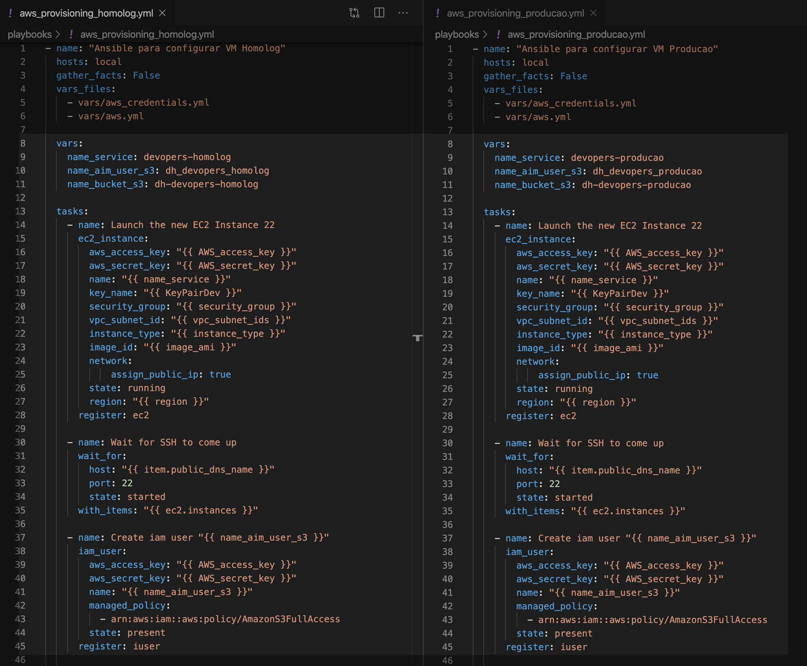

            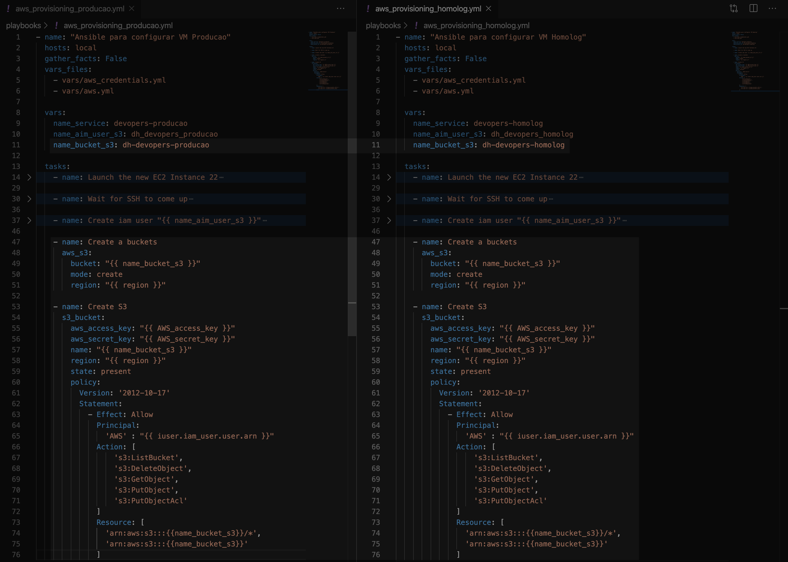

    [Link útil - módulo ansible ec2.](https://docs.ansible.com/ansible/latest/modules/ec2_module.html)

    **Importante**: O nome do bucket S3 possui algumas [regras](https://docs.aws.amazon.com/AmazonS3/latest/dev/BucketRestrictions.html#bucketnamingrules) para ser criado com sucesso, seja pelo playbook como pelo console da Amazon. O básico seria criar com letras minúsculas, sem números ou acentos, entre 3 e 63 caracteres e um nome único - que ninguém tenha usado ainda.

* **Falando um pouco sobre a configuração das máquinas criadas**:
    Dividimos a configuração em 4 arquivos e utilizamos eles de forma dinâmica com o conceito de hosts + o [módulo](https://docs.ansible.com/ansible/latest/modules/ec2_instance_info_module.html) que coleta informações das instâncias, ou seja, podemos incluir quantas máquinas forem necessárias e executar o playbook apenas uma vez, e eles fará a instalação e/ou configuração em todas as máquinas "tagueadas":

    É necessário alterar a linha 14 nos dois arquivos baixo (config_all-ec2.yml e install_docker_all-ec2.yml), caso altere o nome das EC2.        
        ***"tag:Name": ["devopers-jenkins","devopers-homolog","devopers-producao"]*** 

    * config_all-ec2.yml    

        Atualiza pacotes em todas as EC2. Além de instalar uma série de softwares e suas dependências, dentre eles awscli, java, python. 

    * install_docker_all-ec2.yml   

        Instala o docker em todas as EC2. O item abaixo atribuiu o usuário informado no grupo do docker.       
            ***docker__users: ["ubuntu","jenkins"]***  

    * install_ansible_ec2-jenkins.yml       
        Instala ansible e pacotes para facilitar configurações.

    * install_jenkins_ec2-jenkins.yml    
        Instala e configura o Jenkins na EC2 do Jenkins. Os itens abaixo podem/devem ser alterados:
            
        ***jenkins_admin_username: devopers***    
        ***jenkins_admin_password: devopers***

    É necessário alterar a linha 14 nos 4 arquivos acima, caso altere o nome das EC2.

    ***"tag:Name": ["devopers-jenkins"]***    

[Link útil - Módulos Ansible de todas as Clouds.](https://docs.ansible.com/ansible/latest/modules/list_of_cloud_modules.html#)

## Provisionando EC2 + S3 + IAM + ECR na AWS
Partindo do presuposto que seu ambiente de trabalho já está preparado e com as devidas ferramentas instaladas e configuradas, podemos iniciar a criação do ambiente na AWS, caso contrário volte para a Preparação Inicial.

O objetivo é criar um ambiente de Homologação e Produção + um servidor que rodará o Jenkins.
* Ao ser executado o item abaixo irá criar uma VPC e todos os itens obrigatórios relacionados a ela (por exemplo, subnet, security group, entre outros), logo após irá gerar uma key-pair e salvar. Vai criar também uma EC2 para o Jenkins e um ECR (Elastic Container Registry), em seguida uma EC2 para Produção, um user e um bucket S3. E por último criará uma EC2 para Homologação, um user e um bucket S3.

    * `$ ansible-playbook playbooks/aws_provisioning.yml`

O script acima utiliza os seguintes scripts: aws_provisioning_vpc.yml, aws_provisioning_jenkins.yml, aws_provisioning_producao.yml, aws_provisioning_homolog.yml. Todos os playbooks 

* Para validar se foi criado acessar o console da AWS ou executar o seguinte comando:
    * `$ ansible-inventory --graph aws_ec2`

## Configurando Maquinas EC2 
Após todo o ambiente criado na AWS, precisamos configurar as máquinas, todas as 3 EC2 criadas terão os pacotes atualizados e os seguintes itens instalados via ansible: docker, awscli, java, python, entre outros. Já a EC2 do Jenkins vamos instalar também o ansible e o jenkins. 

* Atualizar pacotes e instalar awscli, java, python - Esse script foi preparado para atualizar as 3 EC2 ao ser executado...
    * `$ ansible-playbook playbooks/config_all-ec2.yml`

* Instalar docker - Esse script foi preparado para atualizar as 3 EC2 ao ser executado...
    * `$ ansible-playbook playbooks/install_docker_all-ec2.yml`

* Instalar ansible - Esse script foi preparado para atualizar apenas a EC2 do Jenkins ao ser executado...
    * `$ ansible-playbook playbooks/install_ansible_ec2-jenkins.yml`

* Instalar jenkins - Esse script foi preparado para atualizar apenas a EC2 do Jenkins ao ser executado...
    * `$ ansible-playbook playbooks/install_jenkins_ec2-jenkins.yml`

Observação: todos os playbooks podem ser executados com o parametro "-vvv" para ter um nível maior de detalhes. 
Ex: `$ ansible-playbook playbooks/aws_provisioning.yml -vvv`     

## Configurando Jenkins 
Instalar plugins Jenkins que vamos utilizar em nosso pipeline.
Acessar a url de acordo com o nome ou ip publico gerado na AWS, para isso será necessário entrar no console.

Após logar no Jenkins com usuário e senha definidos no playbook install_jenkins_ec2-jenkins.yml, ir em Gerenciar Jenkins → Gerenciar de Plugins → Disponíveis → procurar e selecionar os seguintes itens:
    1.pipeline
    2.docker pipeline
    3.ssh
    4.github
    5.github api
    6.amazon ecr

Acessar a EC2 via ssh conforme exemplo abaixo (é possivel pegar esse comando no console da AWS também) para validar se o usuário jenkins está incluso no grupo docker do Linux (id jenkins):

ssh -i <key> <usuario>@<host>
ssh -i <chave que o salvou playbook>.pem ubuntu@<nome ou ip publico>   

Caso o usuário não esteja executar o comando abaixo para incluir e depois reiniciar o serviço.
* Verificar usuário
    * `$ id jenkins` 
* Incluir o usuário no grupo
    * `$ sudo addgroup jenkins docker` 
* Parar o serviço do jenkins
    * `$ sudo service jenkins stop`
* Subir o serviço do jenkins
    * `$ sudo service jenkins start`
* Validar o serviço do jenkins
    * `$ sudo service jenkins status`

Configurar nodes Homolog e Produção para a execução do pipeline
Gerenciar Jenkins → Gerenciar nós → novo nó

Adicionar Credenciais para acessar as instâncias
Credentials → Add Credentials
Global e SSH username + private key

Adicionar Credenciais para acessar AWS ECR
Credentials → Add Credentials
AWS Credentials + Global + ID e Private Key AWS

## Customizando Jenkinsfile

## Pipeline Jenkins
Após realizar todas as configurações é possível criar um Job Pipeline que irá no repositório git e fará todo o deploy através do Jenkinsfile.

## APP NodeJS utilizado
Foi realizado um fork do [repositório do Desenvolvedor](https://github.com/bgsouza/digitalhouse-devops-app.git) para [repositório Dev do Projeto](https://github.com/andresavs/digitalhouse-devops-app.git) pois teriamos que customizar o arquivo Jenksfile.

## Evidências
* Pipeline
    * [Pipeline](docs/PipelineOk.png) executado com sucesso.
    * [HealthCheck Homologação](docs/healthcheck-homolog.png) executado com sucesso.
    * [HealthCheck Produção](docs/healthcheck-prod.png) executado com sucesso.
    * [Output Pipeline](docs/Output-Pipeline.pdf) de todos os passos.

* Url
    * [HealthCheck Homologação](docs/url-healthcheck-homolog.png) executado com sucesso.
    * [HealthCheck Produção](docs/url-healthcheck-prod.png) executado com sucesso.
    * [Upload Homologação](docs/url-upload-homolog.png) executado com sucesso.
    * [Upload Produção](docs/url-upload-prod.png) executado com sucesso.

* AWS S3
    * [Buckets S3](docs/Buckets-S3.png) criados.
    * [Bucket S3 Homolog](docs/BucketS3-homolog.png) com a imagem.
    * [Bucket S3 Produção](docs/BucketS3-prod.png) com a imagem.

## Referências
* Professores
    * Bruno G. Souza - https://github.com/bgsouza/digitalhouse-devops-app
    * Krishna Pennacchioni - https://github.com/agentelinux/devops-pi/tree/grupo1
* Material do curso - Playground Digital House
* Documentação Oficial
    * https://www.ansible.com/
    * https://galaxy.ansible.com/
    * https://github.com/
    * https://www.docker.com/
    * https://www.jenkins.io/
    * https://aws.amazon.com/pt/
    * https://www.markdownguide.org/
